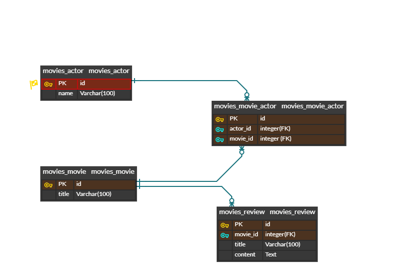

# 서민주 PJT-07 (영화추천 프로젝트)
## 구현사항

<b>프로젝트 명세서</b>에 맞춰서 Actor, Movie, Review 모델을 구현함.

### Actor 모델
- 배우 이름을 name에 저장.
  
### Movie 모델
- 영화 제목을 title에 저장.
- 줄거리를 overview에 저장.
- 개봉일을 release_date에 저장.
- 포스터 주소를 poster_path에 저장.
  
### review 모델
- 리뷰 제목을 title에 저장.
- 리뷰 내용을 content에 저장.
- 외래 키(Movie_id)를 movie_id에 저장.

## 느낀 점 및 배운 점
- 저번 주에 갑작스럽게 REST API를 도입하면서 기존의 template를 사용해서 front를 구현하는 방법이 아닌 온전히 back의 영역으로 넘어가게 돼서 혼란이 왔었음. 이 부분은 아마 새로운 기술 프레임워크를 배울 때마다 생기는 문제점으로 보이며 계속 적응해야 할 것으로 보임.
- ERD CLOUD 툴에 대해 배움. 그러나 아직 ERD 작성이 미숙해서 사용법을 좀 더 익혀야 할 것으로 보임.

## 사용 APP FRAMEWORK
Django

## 데이터베이스 ERD
